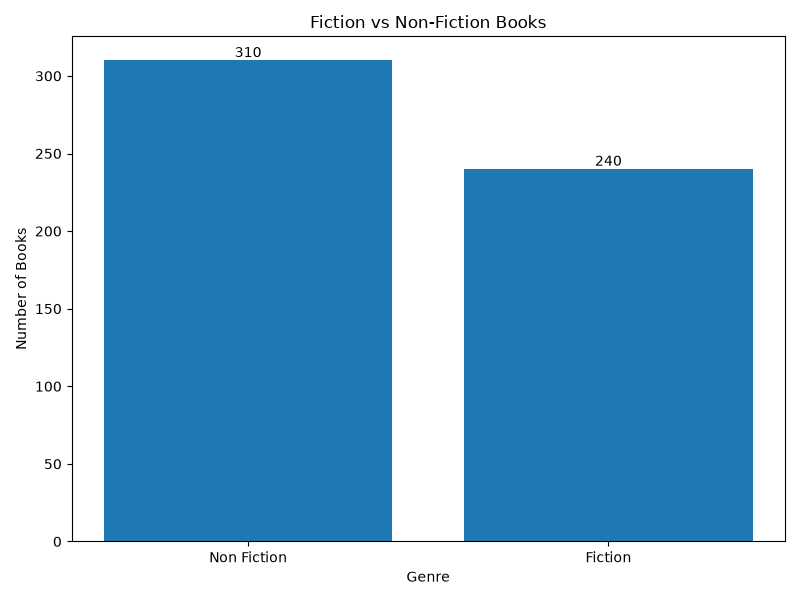
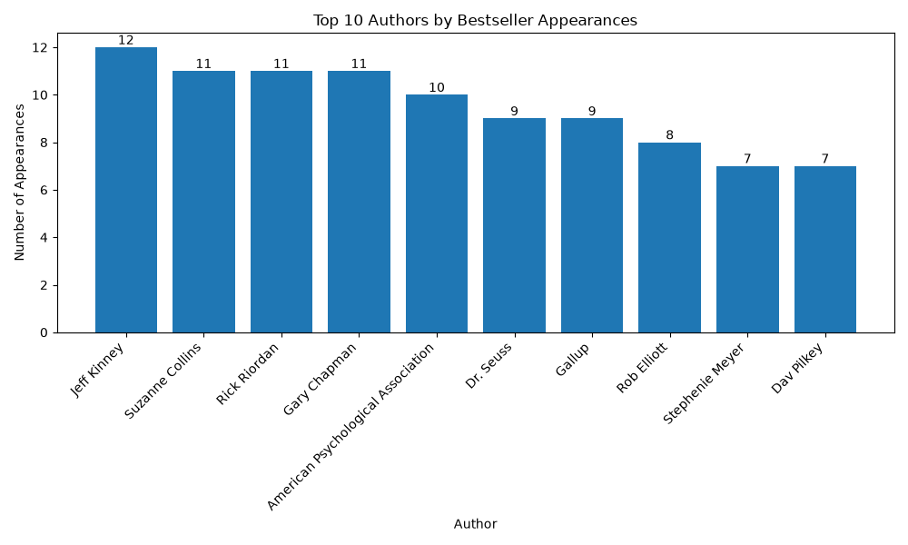
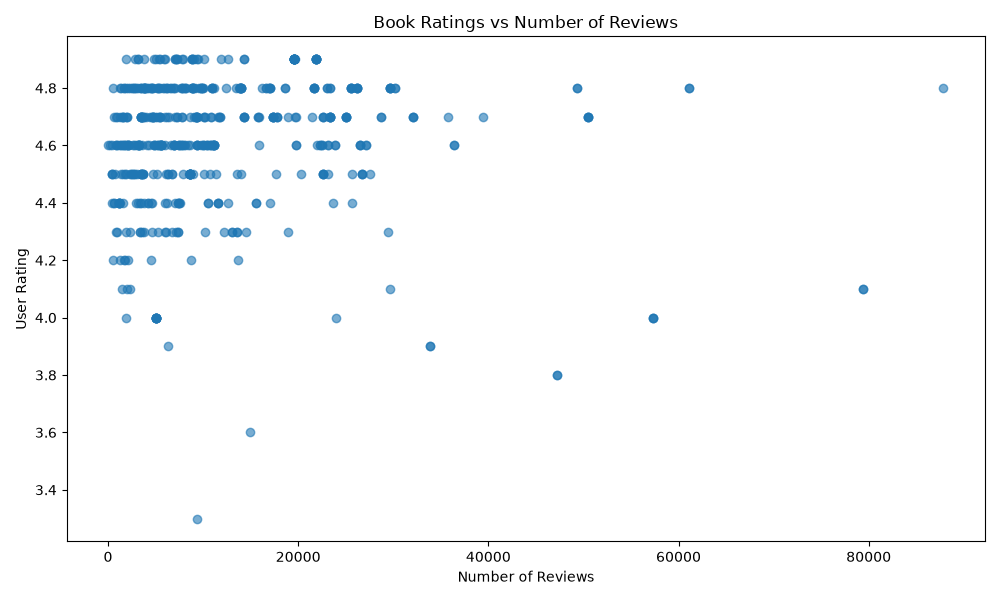
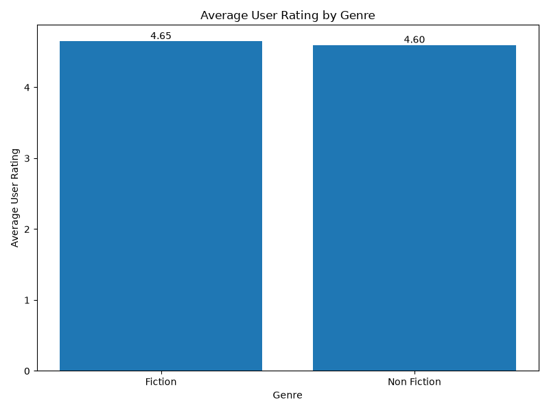
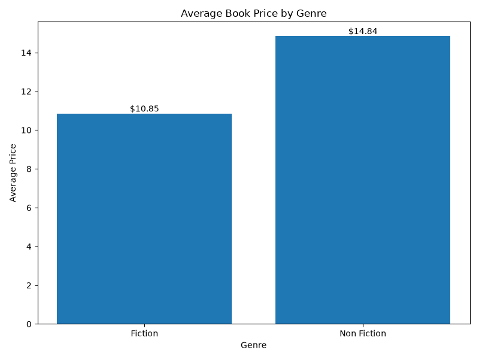
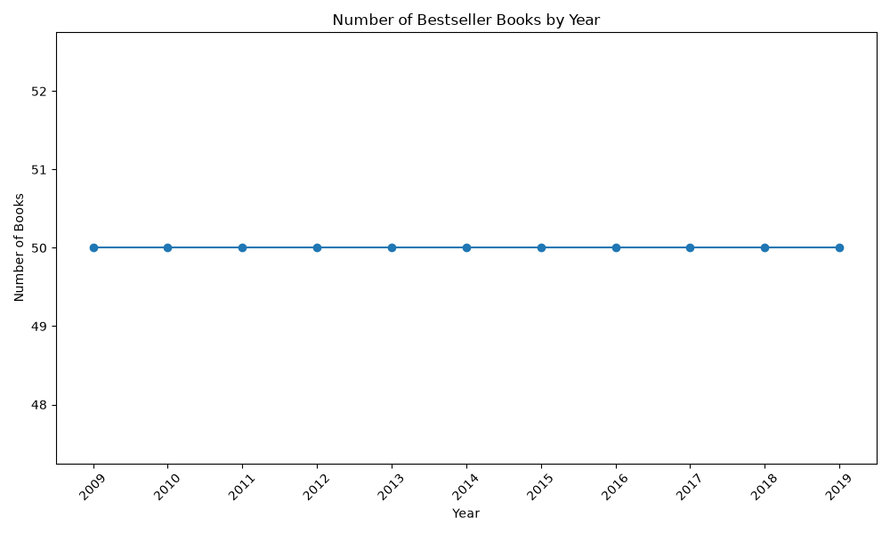
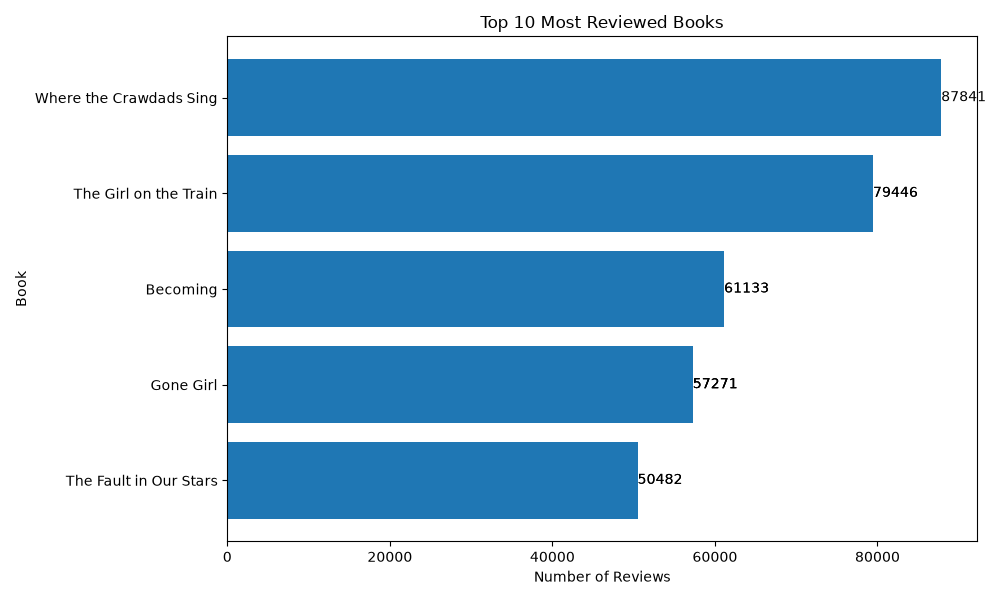

# 📚 Amazon Books Analyzer

An interactive Python-based Exploratory Data Analysis (EDA) project analyzing Amazon bestselling books to identify trends in ratings, reviews, pricing, genres, authors, and publication years.

## 🚀 Live Demo

🔗 **[Open Amazon Books Analyzer](https://amazon-books-analyzer-bz7s7y2mhony4zfvkrff8.streamlit.app/)**

The project is deployed using **Streamlit Community Cloud** and provides an interactive dashboard with dataset filters, statistics, visualizations, and key insights.

---

## 📌 Project Overview

This project performs Exploratory Data Analysis on an Amazon bestselling books dataset containing **550 records**.

The analysis explores:

- ⭐ Book ratings and reviews
- 💰 Book pricing trends
- ✍️ Bestseller appearances by author
- 📖 Fiction vs Non-Fiction distribution
- 📅 Year-wise publishing trends
- 📊 Relationships between ratings, reviews, price, and publication year
- 🔥 Highly rated and highly reviewed books

---

## 🛠️ Technologies Used

- **Python**
- **Pandas**
- **NumPy**
- **Matplotlib**
- **Streamlit**

---

## 📂 Dataset

The dataset contains **550 Amazon bestselling book records** with the following attributes:

| Column | Description |
|---|---|
| `Name` | Book title |
| `Author` | Book author |
| `User Rating` | Average user rating |
| `Reviews` | Number of user reviews |
| `Price` | Book price |
| `Year` | Publication year |
| `Genre` | Fiction or Non Fiction |

---

## 🔎 Analysis Performed

### Exploratory Data Analysis

- Dataset shape and structure
- Column and data type analysis
- Statistical summary
- Author frequency analysis
- Genre distribution
- Rating analysis
- Review analysis
- Price analysis
- Year-wise analysis
- Unique book analysis

### 🧹 Data Cleaning

- Checked for duplicate records
- Checked for missing values
- Removed duplicate records
- Created a cleaned dataset for analysis

### 📊 Statistical Analysis

- Correlation between ratings, reviews, price, and year
- Average rating by genre
- Average price by genre
- Average rating by year
- Books published each year
- Top books based on ratings and reviews

---

## 💡 Key Findings

- The dataset contains **550 records**.
- There are **351 unique book titles**.
- **Non Fiction** is the most common genre.
- The average user rating is approximately **4.62**.
- The average book price is approximately **$13.10**.
- **2019** has the highest average rating at approximately **4.74**.
- *Where the Crawdads Sing* has the highest number of reviews with **87,841 reviews**.
- **Jeff Kinney** has the highest number of bestseller appearances among the analyzed authors.

---

## 📈 Visualizations

The project uses Matplotlib to generate the following visualizations:

### Genre Distribution



### Top Authors



### Ratings vs Reviews



### Average Rating by Genre



### Average Price by Genre



### Books Published by Year



### Top 10 Most Reviewed Books



---

## 🌐 Interactive Streamlit Dashboard

The project also includes an interactive web application built with Streamlit.

The dashboard provides:

- 📊 Key statistics
- 📚 Complete books dataset
- 🔍 Genre filtering
- 📅 Year filtering
- 💡 Key insights
- 📈 Interactive data visualizations

### Try the application:

👉 **[Amazon Books Analyzer – Live Demo](https://amazon-books-analyzer-bz7s7y2mhony4zfvkrff8.streamlit.app/)**

---

## 📁 Project Structure

'''text
Amazon-Books-Analyzer/
│
├── data/
│   └── bestsellers with categories.csv
│
├── Images/
│   ├── genre_distribution.png
│   ├── top_authors.png
│   ├── ratings_vs_reviews.png
│   ├── average_rating_by_genre.png
│   ├── average_price_by_genre.png
│   ├── books_published_by_year.png
│   └── top_10_most_reviewed_books.png
│
├── analysis.py
├── app.py
├── requirements.txt
├── README.md
└── .gitignore
'''


## ⚙️ Installation & Setup

### 1. Clone the repository

```bash
git clone https://github.com/SupremeYaskin0806/Amazon-Books-Analyzer.git
cd Amazon-Books-Analyzer
